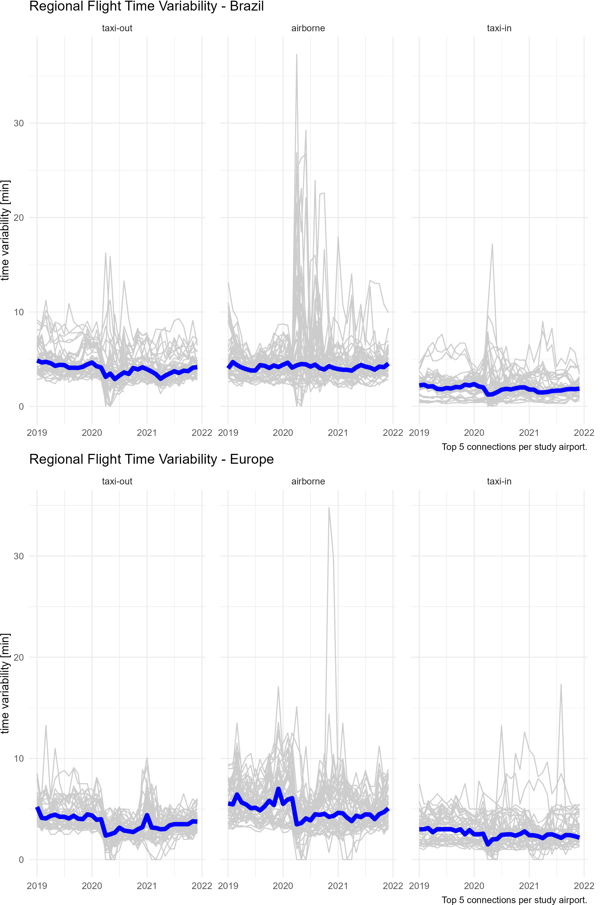

# Efficiency

Operational efficiency is a critical component in assessing the management and execution of operations. 
It provides insights in the management of arrival and departure flows and the associated separation and synchronisation activities. 
Inefficiencies can have an impact on user operations in terms of delays or excessive fuel burn. 

The measures reported in this study are based on the observed travel time for surface operations (i.e. taxi-in and taxi-out) and during the arrival phase. 
These travel times are compared with an associated reference time for a group of flights showing similar operational characteristics. 
The determined difference (i.e. additional times) measures the level of inefficiencies. 
It must be noted that high performance operations will still yield a certain share of measured additional times.
Operational efficiency is therefore aiming at the minimizing rather than eliminating these additional times as they cannot be zero.

## Additional Taxi-In Time

The additional taxi-in time measures the travel time of an arriving flight from its touchdown (i.e. actual landing time [ALDT]) to its stand/gate position (i.e. actual in-block time [AIBT]). 
The observed travel time (i.e. taxi time) is compared to a reference time. 
The reference time is determined for flights arriving at the same runway and/or the same stand/gate position. 
Research showed that the taxi-times are not dependent on the type of aircraft. 
The additional taxi-in time provides a pointer for the management of the inbound surface traffic.

Due to data availability constraints (i.e. no stand/gate information), the reference times for the Brazilian airports have been computed on the airport level. 
It needs to be noted that such aggregation at the airport level may be influenced by the predominant runway configuration and frequently used stand/parking positions.
This phenomenon merits further study in one of the future editions.

Figure \@ref(fig:txit) shows the variation of the observed additional taxi-in times.

(ref:txit) Additional taxi-in time

<!-- 
DATA PREP
check for this to be lifted and better organised, i.e. crunch date and complement summaries for 2020, 2021!
--> 

```{r}
pth <- "./data"
# fns <- list.files(path = pth, pattern = "BRA_EUR_SB.*_DEV2.csv")
fns <- list.files(path = pth, pattern = "BRA_EUR_SB.*_DEV3.csv")
bra_old <- paste0(pth,"/",fns) %>%
  purrr::map_dfr(
    .f = ~ readr::read_csv(., col_types = cols(.default = col_double()
                                               ,AIRPORT = col_character())
    ))


#---------- PBWG ------ more aggressive REF TIME -----------------------------
# BRAZIL --------------
fns <- list.files(path = pth, pattern = "BRA-EUR_BRA-TX*", full.names = TRUE)
bra_192021 <- fns %>% purrr::map_dfr(.f = ~ read_csv(.x, show_col_types = FALSE))

# EUROPE --------------
fns <- list.files(path = pth, pattern = "PBWG-EUR-TX*", full.names = TRUE)
eur_192021 <- fns %>% purrr::map_dfr(.f = ~ read_csv(.x, show_col_types = FALSE))

eur_txxts <- read_csv("./data/BRA-EUR_EUR_TXXTS.csv")


prep_bar_chart <- . %>% 
  mutate(YEAR = substring(DATE, 1, 4) %>% as.numeric) %>% 
  group_by(AIRPORT, YEAR, PHASE) %>% 
  summarise(FLIGHTS = sum(FLIGHTS), TOT_TXXT = sum(TOT_TAXI)
            , TOT_REF = sum(TOT_REF)
            , .groups = "drop") %>% 
  mutate(AVG_ADD_TXXT = (TOT_TXXT - TOT_REF) / FLIGHTS) 

eur_192021 <- eur_txxts %>% 
  filter(YEAR %in% c("2019","2020","2021")) %>% 
  rename(DATE = MOF, PHASE = SRC_PHASE, AIRPORT = ICAO, FLIGHTS = N_VALID, TOT_TAXI = TOT_TXXT)

# txit eur_192021
bra <- bra_192021 %>% filter(PHASE == "ARR") %>%  prep_bar_chart() %>% rename(AVG_ADD_TXIT = AVG_ADD_TXXT)
eur <- eur_192021 %>% filter(PHASE == "ARR") %>%  prep_bar_chart() %>% rename(AVG_ADD_TXIT = AVG_ADD_TXXT)
```

```{r txit, fig.cap="(ref:txit)"}
tmp_b <- bra %>% 
  select(AIRPORT, YEAR, AVG_ADD_TXIT) %>% mutate(REGION = "BRA")
tmp_e <- eur %>% 
  select(AIRPORT, YEAR, AVG_ADD_TXIT) %>% mutate(REGION = "EUR")

tmp <- bind_rows(tmp_b, tmp_e)

## for the coord flip to work use "hacky solution" to order cols
## https://stackoverflow.com/questions/49448497/coord-flip-changes-ordering-of-bars-within-groups-in-grouped-bar-plot
## set postion_dodge(-.x) to reverse order
## need to study how to reverse order of factor
## check also forcats: fct_rev() and/or do same to fill

tmp <- tmp %>% mutate(YEAR = factor(YEAR))

ggplot(data = tmp, mapping = aes(x = AIRPORT, y = AVG_ADD_TXIT, fill = YEAR)) +
  geom_col(position = position_dodge(-.9), width = 0.9) +
  geom_hline(yintercept = c(2,4), linetype = "dotted") +
  coord_flip() + 
  facet_wrap(.~REGION, scales = "free_y") +
  my_own_theme_minimal +
  theme(legend.position = "top"
        ,legend.title    = element_text(size = 8) 
        ,legend.text     = element_text(size = 8)
        ,legend.key.size = unit(0.3, "cm")
        ) +
  labs(x = NULL, y = "average additional taxi-in time [min/arr]"
       ,fill = "year") +
  scale_fill_brewer(palette = "GnBu")
```

<!--
check LIRF data for 2019
-->

The observed additional taxi-in times vary across the different airports. 
The majority of airports have average additional taxi-in times  at or below 2 minutes per arrival. 
This suggests that arrivals are rarely subject to taxi constraints. 

In Europe, Rome Fiumicino (LIRF) observed additional taxi-in times of higher than 4 minutes per arrival in 2019. 
With the decreasing traffic load during 2020 and 2021, additional taxi-in times fell sharply to 2,5 min in 2020 and 2,15 minutes per arrival. 
At London Heathrow (EGLL), average additional taxi-in times improved in 2020 by about three quarters of a minute. 
However, with increasing traffic load in 2021, higher additional taxi-in times were accrued again. 
A similar pattern was observed at other European airports with increasing additional taxi-in times, e.g. Zurich (LSZH), Paris Charles de Gaulle (LFPG), Madrid (LEMD), Amsterdam (EHAM), Munich (EDDM), and Frankfurt (EDDF). 
This suggests that there are still local procedures in place to address COVID or post-COVID related utilisation of stands. 

Additional taxi-in times in Brazil varied across the airports. 
Traffic at Rio de Janeiro’s Galeão (SBGL) airport deteriorated significantly. 
Despite lower traffic levels, the additional taxi-in time increased from around 3 minutes in 2019; to just under 4 minutes per arrival in 2020, and further increased to just under 6 minutes per arrival in 2021. 
Rio de Janeiro (SBRJ) observed an increase to over 3 minutes per arrival in 2020 and 2021. 
Arriving traffic at Porto Alegre (SBPA) experienced lower additional taxi-in times in 2021. 
Compared to 2019 and 2020, performance improved by over a minute per arrival. 
On average, additional taxi-in times decreased at the other airports across the years. Thus, showing a positive associated with decreasing traffic.

The variations across the airports suggests that local specifics contributed to the varying taxi-in performance.

```{r}
sbgl <- bra_192021 %>% 
  filter(AIRPORT == "SBGL", PHASE == "ARR") %>%
  mutate(DATE = lubridate::parse_date_time(DATE, "ym", tz ="UTC"))

p_sbgl_tfc <- sbgl %>% 
  ggplot() +
    geom_line(aes(x = DATE, y = FLIGHTS / lubridate::days_in_month(DATE))) +
    labs(x = NULL, y = NULL, subtitle = "SBGL - average daily arrivals")

p_sbgl_addtxit <- sbgl %>% 
  ggplot() +
    geom_line(aes(x = DATE, y = TOT_ADD / FLIGHTS)) +
    labs(x = NULL, y = NULL, subtitle = " average add. taxi-in time [min/arr]")


lirf <- eur_192021 %>% 
  filter(AIRPORT == "EGLL", PHASE == "ARR") %>%
  mutate(DATE = lubridate::parse_date_time(DATE, "ym", tz ="UTC"))

p_lirf_tfc <- lirf %>% 
  ggplot() +
    geom_line(aes(x = DATE, y = FLIGHTS / lubridate::days_in_month(DATE))) +
    labs(x = NULL, y = NULL, subtitle = "EGLL - average daily arrivals")

p_lirf_addtxit <- lirf %>% 
  ggplot() +
    geom_line(aes(x = DATE, y = TOT_ADD / FLIGHTS)) +
    labs(x = NULL, y = NULL, subtitle = " average add. taxi-in time [min/arr]")
```

(ref:txitcloselook) Monthly evolution of additional taxi-in time at SBGL and EGLL 

```{r txitcloselook, fig.cap="(ref:txitcloselook)"}
plot_sbgl <- p_sbgl_tfc / p_sbgl_addtxit + plot_layout(heights = c(1,2))
plot_lirf <- p_lirf_tfc / p_lirf_addtxit + plot_layout(heights = c(1,2))

wrap_plots(plot_sbgl, plot_lirf, nrow = 1)
```

Figure \@ref(fig:txitcloselook) compares the evolution of the additional taxi-in time at two of the study airports. 
A sharp increase of the average additional taxi-in time is observed at both Galeão (SBGL) and London Heathrow (EGLL) by the end of 2020, despite significantly lower daily traffic in comparison to 2019. 
At SBGL, the observed average monthly additional taxi-in times increased even further in the beginning of 2021.
EGLL saw a drop following the Chrismas/New Year season and then experienced a strong increase of the additional taxi-in times.
These patterns have to be contrasted with with the shallow increase of daily traffic.


## Additional Taxi-Out Time

The additional taxi-out time addresses the travel time of a departing aircraft from when it can move away from its stand/gate position (i.e. actual off-block time [AOBT]) until the aircraft takes off (i.e. actual take-off time [ATOT]). 
This travel time is compared to an associated reference time.

As mentioned above, the taxi-times at Brazilian airports are determined on the airport level and the observed additional taxi-out times may be influenced by the predominant runway system - stand combinations for departure traffic.
The inclusion of stand/gate positions is foreseen for future iterations. 

(ref:txot) Additional taxi-out time

```{r txot, fig.cap="(ref:txot)"}
# EUROPE --------------
fns <- list.files(path = pth, pattern = "PBWG-EUR-TX*", full.names = TRUE)
eur_192021 <- fns %>% purrr::map_dfr(.f = ~ read_csv(.x, show_col_types = FALSE))

# data prep based on PWBG
bra <- bra_192021 %>% filter(PHASE == "DEP") %>%  prep_bar_chart() %>% rename(AVG_ADD_TXOT = AVG_ADD_TXXT)
eur <- eur_192021 %>% filter(PHASE == "DEP") %>%  prep_bar_chart() %>% rename(AVG_ADD_TXOT = AVG_ADD_TXXT)

tmp_b <- bra %>% 
  select(AIRPORT, YEAR, AVG_ADD_TXOT) %>% mutate(REGION = "BRA")
tmp_e <- eur %>% 
  select(AIRPORT, YEAR, AVG_ADD_TXOT) %>% mutate(REGION = "EUR")
tmp <- bind_rows(tmp_b, tmp_e)

ggplot(data = tmp, mapping = aes(y = AIRPORT, x = AVG_ADD_TXOT, fill = as.factor(YEAR))) +
  geom_col(position = position_dodge(-.9), width = 0.9) +
  geom_vline(xintercept = c(4,6,8), linetype = "dotted") +
  facet_wrap(.~REGION, scales = "free_y") +
  my_own_theme_minimal +
  theme(legend.position = "top"
        ,legend.title    = element_text(size = 8) 
        ,legend.text     = element_text(size = 8)
        ,legend.key.size = unit(0.3, "cm")
        ) +
  labs(x = NULL, y = "average additional taxi-out time [min/arr]"
       ,fill = "year") +
  scale_fill_brewer(palette = "GnBu") +
  scale_x_continuous(label = ~ scales::comma(.x, accuracy = 1))
```

San Salvador (SBSV) in Brazil and Europe’s Rome Fiumicino (LIRF) and London Heathrow (EGLL) observed high average additional taxi-out times in 2019. For the majority of the airports, average additional taxi-out times are at or below 4 minutes per departure. 
In both regions, taxi-out performance was affected by the lower level of air traffic and typically resulted in a reduction of the average additional taxi-out time.
In Brazil however, SBGL and SBBR showed increased additional taxi-out times in 2020 compared to 2019. 
This signals a substantial change of the taxi-operations based on the predominant usage of stands.
Interestingly, additional taxi-out times varied differently across airports when comparing 2020 vs 2021.
While in many instances the change is neglible (smaller than 30 sec per departure), Munich (EDDM) and Amsterdam (EHAM) showed a discernible increase in the observed additional taxi-out times. 
This was related to the re-opening of closed parts of the terminal in line with the general increase in air traffic. 

In both regions, flights observed a higher additional taxi-out time than taxi-in time.
Thus, air traffic services in both regions manage departure queues more actively by separating and sequencing traffic within the maneuver area.
This may be linked to higher interactions between departing traffic, or departing and arriving traffic. 

## Mapping of Taxi-out and Taxi-in

(ref:txit-txot-scatter) Comparison and evolution of additional taxi-in and taxi-out times

```{r txit-txot-scatter, fig.cap="(ref:txit-txot-scatter"}
# data prep based on PWBG
bra_txot <- bra_192021 %>% filter(PHASE == "DEP") %>%  prep_bar_chart() %>% rename(AVG_ADD_TXOT = AVG_ADD_TXXT) %>% mutate(REGION = "BRA") %>% select(AIRPORT, REGION, YEAR, AVG_ADD_TXOT, DEPS = FLIGHTS)
eur_txot <- eur_192021 %>% filter(PHASE == "DEP") %>%  prep_bar_chart() %>% rename(AVG_ADD_TXOT = AVG_ADD_TXXT) %>% mutate(REGION = "EUR") %>% select(AIRPORT, REGION, YEAR, AVG_ADD_TXOT, DEPS = FLIGHTS)
# txit
bra_txit <- bra_192021 %>% filter(PHASE == "ARR") %>%  prep_bar_chart() %>% rename(AVG_ADD_TXIT = AVG_ADD_TXXT) %>% mutate(REGION = "BRA") %>% select(AIRPORT, REGION, YEAR, AVG_ADD_TXIT, ARRS = FLIGHTS)
eur_txit <- eur_192021 %>% filter(PHASE == "ARR") %>%  prep_bar_chart() %>% rename(AVG_ADD_TXIT = AVG_ADD_TXXT) %>% mutate(REGION = "EUR") %>% select(AIRPORT, REGION, YEAR, AVG_ADD_TXIT, ARRS = FLIGHTS)

tmp_b <- left_join(bra_txot, bra_txit)
tmp_e <- left_join(eur_txot, eur_txit)

tmp <- bind_rows(tmp_b, tmp_e)
tmp2 <- tmp %>% mutate(LABEL = case_when(YEAR == 2019 ~ AIRPORT, TRUE ~ NA_character_)) %>% 
  mutate(YEAR = factor(YEAR, levels = c(2019, 2020, 2021)))

tmp2 %>% 
  ggplot(aes(x = AVG_ADD_TXOT, y = AVG_ADD_TXIT)) + 
  geom_abline(intercept = 0, slope = 1, linetype = "dashed", colour = "grey60") +
  #coord_equal() +
  #geom_abline()
    geom_path(aes(group = AIRPORT), colour = "grey70") + 
    geom_point(aes(shape = YEAR, colour = YEAR), size = 2) + 
    scale_colour_brewer(palette = "GnBu") +
    geom_label_repel(aes(label = LABEL)
                    , nudge_x = 2
                    , force = 10
                    , max.overlaps = Inf
                    , box.padding = 1
                    , na.rm = TRUE
                    , colour = "red", segment.colour = "red") + 
 scale_x_continuous(limits = c(0,NA)) +
  scale_y_continuous(limits= c(0, NA)) +
   facet_grid(. ~REGION) +
  my_own_theme_minimal +
  theme(legend.position = "top"
        ,legend.title    = element_text(size = 8) 
        ,legend.text     = element_text(size = 8)
        ,legend.key.size = unit(0.3, "cm")
        ) +
  labs( x = "average additional taxi-out time [min/dep]"
       ,y = "average additional taxi-in time [min/arr]"
       ,fill = "year") +
  scale_fill_brewer(palette = "GnBu")
# +
#  scale_x_continuous(label = ~ scales::comma(.x, accuracy = 1))
```

The following analysis builds on the observations of the previous sections.
Figure \@ref(fig:txit-txot-scatter) reveals different patterns in Brazil and Europe. 
In general surface movement operations see a higher variation in Brazil than in Europe. 
Within the European region London Heathrow (EGLL) and Rome Fiumicino (LIRF) experienced a strong reduction of the additional taxi-out time due to the reduced traffic in 2020. 
On average the returning traffic did not impact the additional taxi-in and taxi-out times observed in 2020 and 2021.

With the exception of Rome Fiumicino (LIRF) and London Heathrow (EGLL) and the observed high additional taxi-out times at these airports, the spread between additional taxi-in and taxi-out time is smaller in Europe than in Brazil. 
This suggests that operational constraints are of systemic nature and less dependent on the level of traffic.
This may reveal differences in the management of arriving and departing traffic in both regions.
All European airports of this study operate ACDM [^ACDMeur] processes. 
ACDM aims to optimise the use of resources and improving the predictability of air traffic, in particular departing traffic.
Further research is needed to analyse the impact of ACDM on the departure process with the average additional taxi-out times typically 2-3 minutes higher than the additional taxi-in times.


[^ACDMeur]: ACDM implementation at EGKK is on-going, c.f. https://www.eurocontrol.int/concept/airport-collaborative-decision-making.

## Evolution of Additional Taxi-Times in early 2022

This section highlights and compares the performance observed in the first part of 2022, i.e. January through June.
Typically, taxi-in operations are less constrained than taxi-out operations. 
However, flights taxiing in may be subject to interaction with other surface movements when approaching the apron or need to hold until a parking position is vacated.

```{r}
txits_bra <- read_csv("./data/bra_txits_corrected.csv")
# trim data
txits_bra <- txits_bra %>% filter(MOF < lubridate::ymd("2022-07-01"))
```

```{r}
plot_monthly_txits <- function(.df, .subtitle = NULL){
  myplot <- .df %>% 
  ggplot() +
  geom_line(aes(x = lubridate::month(MOF), y = AVG_ADD_TXIT, color = as.factor(lubridate::year(MOF)), group = lubridate::year(MOF))) +
  geom_point(aes(x = lubridate::month(MOF), y = AVG_ADD_TXIT, color = as.factor(lubridate::year(MOF)))) +
  scale_x_continuous(breaks = c(1,4,7,10), labels = month.abb[c(1,4,7,10)], minor_breaks = 1:12) +
  scale_colour_brewer(palette = "Blues") +
  facet_wrap(.~ICAO) +
  theme(panel.spacing.x = unit(4, "mm")
        ,legend.position = "top") +
  labs(x = NULL, y = "additional taxi-in time [min/arr.]"
       ,subtitle = .subtitle
       ,color = NULL)
  return(myplot)
}
```

(ref:monthly-txits-bra) Evolution of monthly average additional taxi-in times at Brazilian study airports

```{r monthly-txits-bra, fig.cap="(ref:monthly-txits-bra)"}
p <- plot_monthly_txits(txits_bra)
p
```

Figure \@ref(fig:monthly-txits-bra) shows the monthly evolution of the average additional taxi-in times in Brazil. 
On average, monthly additional taxi-in times showed a smoother behaviour in 2020, 2021, and the first half of 2022 than in comparison to 2019.
In particular, a higher level of variation and share of additional taxi-in times were observed in 2019 at Galeão (SBGL), São Paulo/Guarulhos (SBGR), São Paulo (SBSP), and for the first part of the year in Salvador (SBSV).
For the beginning of 2022 arriving flights in Brazil accrued additional taxi-in times of 2 minutes or less. 
This evidences that incoming flights are not subject to higher constraints while taxiing in.  

Is taxi-out working?

```{r}
txots_bra <- read_csv("./data/bra_txots_corrected.csv") 
# trim data
txots_bra <- txots_bra %>% 
  filter(MOF < lubridate::ymd("2022-07-01")) %>% 
  # fix spike SBSP
  mutate(AVG_ADD_TXOT = ifelse(AVG_ADD_TXOT > 7.5, 2.1, AVG_ADD_TXOT))
```

```{r}
plot_monthly_txots <- function(.df, .subtitle = NULL){
  myplot <- .df %>% 
  ggplot() +
  geom_line(aes(x = lubridate::month(MOF), y = AVG_ADD_TXOT, color = as.factor(lubridate::year(MOF)), group = lubridate::year(MOF))) +
  geom_point(aes(x = lubridate::month(MOF), y = AVG_ADD_TXOT, color = as.factor(lubridate::year(MOF)))) +
  scale_x_continuous(breaks = c(1,4,7,10), labels = month.abb[c(1,4,7,10)], minor_breaks = 1:12) +
  scale_colour_brewer(palette = "Blues") +
  facet_wrap(.~ICAO) +
  theme(panel.spacing.x = unit(4, "mm")
        ,legend.position = "top") +
  labs(x = NULL, y = "additional taxi-out time [min/dep.]"
       ,subtitle = .subtitle
       ,color = NULL)
  return(myplot)
}
```

(ref:monthly-txots-bra) Evolution of monthly average additional taxi-out times at Brazilian study airports

```{r monthly-txots-bra, fig.cap="(ref:monthly-txots-bra)"}
p <- plot_monthly_txots(txots_bra)
p
```

Figure \@ref(fig:monthly-txots-bra) shows the taxi-out performance observed at Brazilian study airports.
The monthly taxi-out performance, on average, improved in comparison to 2019 at all airports. Brazilia is the only airport that showed a higher level of variability in 2020 during the first month of COVID.
With the exception of Rio de Janeiro (SBRJ) and Sao Paulo (SBSP), observed additional taxi-out times follow the pattern of 2020 and 2021.
This suggests that taxi-out procedures were adapted during COVID and taxi-out performance was stabilised on similar levels.
SBRJ showed a step increase in taxi-put time in April 2022. Additional taxi-out times before and after the step were constant. This suggests a procedural change at the airfield. 
SBSP showed an increase in accrued additional taxi-out times as of February 2022 and reached levels of taxi-out performance simlar to pre-COVID levels (2019).


## Additional Time in Terminal Airspace

The additional time in terminal airspace is calculated as the difference between the actual travel time from entering the sequencing area (100NM radius around the airport) to the landing time and an associated reference time for the entry sector, aircraft class, and landing runway. The reference times are established based on 2019.

(ref:asma) Additional time in terminal airspace

```{r asma, fig.cap="(ref:asma)"}
# read Brazilian data
bra_asma <- readr::read_csv("./data/BRA-EUR_BRA-ASMA.csv")

bra_apts <- c("SBBR","SBGR","SBSP","SBKP","SBRJ","SBGL","SBCF","SBSV","SBPA","SBCT")

tmp_b <- bra_asma %>% filter(ADES %in% bra_apts) %>% 
  select(AIRPORT = ADES, YEAR, AVG_ADD_ASMA = AVG_ASMA, N_VALID) %>% 
  mutate(REGION = "BRA"
         ,YEAR = case_when(
                 YEAR == 2019 ~ 2020
                ,YEAR == 2018 ~ 2019
                ,YEAR == 2021 ~ 2021)
         )

# read and prepare European data
eur_asma <- readr::read_csv("./data/BRA-EUR_EUR_ASMA.csv")

tmp_e <- eur_asma %>% 
  filter(YEAR %in% 2019:2021) %>% 
  group_by(ICAO, YEAR) %>% 
  summarise(N_VALID = sum(N_VALID)
            , ADD_ASMA = sum(TOT_ADD), .groups = "drop"
            ) %>% 
  mutate(AVG_ADD_ASMA = ADD_ASMA / N_VALID, REGION = "EUR") %>% 
  rename(AIRPORT = ICAO)

tmp <- bind_rows(tmp_b, tmp_e)

ggplot(data = tmp, mapping = aes(y = AIRPORT, x = AVG_ADD_ASMA, fill = as.factor(YEAR))) +
  geom_col(position = position_dodge(-.9), width = 0.9) +
  geom_vline(xintercept = c(2,4), linetype = "dotted") +
  facet_wrap(.~REGION, scales = "free_y") +
  my_own_theme_minimal +
  theme(legend.position = "top"
        ,legend.title    = element_text(size = 8) 
        ,legend.text     = element_text(size = 8)
        ,legend.key.size = unit(0.3, "cm")
        ) +
  labs(x = NULL, y = "average additional time in terminal airspace [min/arr]"
       ,fill = "year") +
  scale_fill_brewer(palette = "GnBu") +
  scale_x_continuous(label = ~ scales::comma(.x, accuracy = 1))
```

Figure \@ref(fig:asma) shows the observed annual average additional time in terminal airspace for all airports. 
The additional time in terminal airspace followed different patterns in Brazil and Europe.
Generally, additional ASMA times are higher in Brazil than in Europe [^ASMAconvention], although, arrival sequencing in 2019 (pre-COVID) shows some airports in Europe with extremely high additional times, e.g. Zurich (LSZH), London Heathrow (EGLL), and London Gatwick (EGKK). 

[^ASMAconvention]: The assessment of additional ASMA time for Brazil is based on a dataset that spans several months and partial years. For this study, data for 2018 is attributed to 2019. The data set will be complemented in future updates of this comparison. The overall behaviour of arrival times is assumed to not be affected across the years.  

The approach concept for London arrivals differs from other airports. 
To achieve maxium runway utilization, aircraft are held close to the airport. 
This resulted in higher ASMA times in 2019. 
The observed additional ASMA times for EGLL and EGKK in 2021 need to be interpreted based on the GANP algorithm chosen for this report.
Reference times are determined based on the actual travel times in 2019. 
Thus, the negative annual average ASMA time for Heathrow (EGLL) and the extremely low result for Gatwick (EGKK) in 2021 demonstrate that at both airports the lower traffic levels in the following years are served differently. 
Obviously, the 2019 reference times comprise procedural elements, i.e. include sequencing induced additional time, and are too high for the observed traffic in 2021.
For future studies it will be interesting to enhance the metric to account for substantial changes of the prevailing traffic. 
This also highlights that the London arrival and procedures benefitted significantly from the lower air traffic and yielded less holding and sequencing constraints on airspace users.
Across the other European airports the change between the pre-COVID year 2019 and the observed performance in 2020 and 2021 is clearly visible. However, the overall change between 2020 and 2021 is - on average - negligible. 
This suggests that the metric measures procedural aspects in the arrival management at these airports offering room for improvement as these accrued additional times are independent of the traffic.
Traffic at São Paulo Guarulhos (SBGR) observed additional times in 2019 and 2020 above four minutes per arrival.
Its reduction in 2021 may be related to the new airspace design for São Paulo TMA and correlated airways changes, the TMA SP Neo Project implemented in May/2021. Higher additional times are observed in 2021 at Campinas (SBKP), Curitiba (SBCT), and Brasilia (SBBR), which also can derive from airways modification. DECEA keeps this assessment ongoing, as the demand returns to 2019 levels. 
For the majority of Brazilian airports, arrival traffic in 2021 experienced higher additional times than in the previous years, while the observed additional times for 2019 and 2020 ranged in the same order of magnitude.
The average additional times at Brazilian airports ranged typically between two and four minutes per arrival.
Traffic at São Paulo Guarulhos (SBGR) observed additional times in 2019 and 2020 above four minutes per arrival.
   
For future reports the data for the assessment of the additional terminal time will be complemented for Brazil. 
This will allow to better investigate the changes observed across the years [^ASMAconvention].
This edition of the comparison suggests that there were changes to the en-route / arrival interface across the majority of Brazilian airports.


(ref:asma-vs-traffic) Comparison of additional time in terminal airspace

```{r asma-vs-traffic, fig.cap="(ref:asma-vs-traffic)"}
bra_apts <- c("SBBR", "SBGR", "SBSP", "SBKP", "SBRJ", "SBGL", "SBCF", "SBSV", "SBPA", "SBCT")

bra_asma <- bra_asma %>% filter(YEAR %in% c(2019,2021), ADES %in% bra_apts) %>% 
  mutate(REGION = "BRA") 

# prep EUR data
eur_asma2 <- eur_asma %>% 
  filter(YEAR %in% c(2019,2021)) %>% 
  group_by(ICAO, YEAR) %>% 
  summarise(N_VALID = sum(N_VALID)
            , ADD_ASMA = sum(TOT_ADD), .groups = "drop"
            ) %>% 
  mutate(AVG_ADD_ASMA = ADD_ASMA / N_VALID, REGION = "EUR") %>% 
  rename(ADES = ICAO, AVG_ASMA = AVG_ADD_ASMA)

asma <- bind_rows(bra_asma, eur_asma2)

asma_tfc <- asma %>% 
  ggplot() +
  geom_point(aes(x = N_VALID, y = AVG_ASMA, color = REGION))  +
  scale_colour_manual(values = bra_eur_colours, labels = c("BRA","EUR")) +

    geom_text_repel(aes(x = N_VALID, y = AVG_ASMA, label = ADES)
           # , nudge_x = -1, nudge_y = 1
            #, point.padding = 0.5, box.padding = 1
           ) +

  geom_hline(yintercept = c(3.5, 6), linetype = "longdash", color = "grey") +
  geom_vline(xintercept = c(125000, 175000), linetype = "dashed", color = "grey") +
  facet_wrap(.~YEAR, ncol = 1) +
  labs(x = "(valid) annual arrivals", y = "average additional time [min/arrival]"
       ,color = "Region") +
  my_own_theme_minimal

asma_tfc
```

Figure \@ref(fig:asma-vs-traffic) shows the change of average additional time in terminal airspace in both regions comparing 2019 to 2021 [^validasma].

[^validasma]: The additional time in terminal airspace is calculated for arrival flights for which the required data was available. Accordingly, the number of "valid" flights might differ from the overall number of arrivals reported for the airports. 

This comparison shows the effect of the decline of air traffic in the European region on arriving traffic.
For all airports, the lower traffic levels resulted in a reduction of the additional time accrued by the arrivals.
However it is also noteworthy to stress that in several cases, procedures have a prevalent role on arrival sequencing. 
This can be observed for airports that show a relatively low change of the observed additional time while the number of arrivals significantly declined.

Overall, the change in terms of observed average additional time in the terminal airspace is characterised by a rearrangement of the airports. 
The overall trend of an increase in sequencing times for arrivals was shown already in Fig. \@ref(fig:asma).
Based on the available data for this assessment (c.f. number of valid flights), the change in operational procedures might be masked. This will require further investigations in future editions of this bi-regional comparison.
However, it is evident that the Brazilian system showed a lower level of change in the management of arrival traffic when comparing 2019 and 2021, recalling that the comparison kept the unimpeded reference time from 2019 for all years.
This suggests that the observed performance is representative of the region, i.e. applied operational procedures, and less dependent on the volume of air traffic.

## Flight Time Variability

Flight time variability determines the level of predictability for airspace users and hence has an impact on airline scheduling.
It focuses on the variance associated with the individual phases of flight as experienced by airspace users.
This provides an integrated gate-to-gate view, as flight time is determined by the taxi-out, en-route, and taxi-in durations.
Although the measure (i.e. flight time) may also be impacted by weather influences, runway system orientation of departure and arrival aerodrome, and prevailing en-route weather conditions, the variability of the flight time comprises also synchronisation and sequencing measures of air navigation services, including airspace constraints.

For this report, flight time variability is calculated for the top 5 connections between the study airports. 
This serves as a proxy for the regional networks. 
Variability is determined as the half of the spread between the 85th and 15th percentile for flights on these connections.

(ref:flight-time-var) Monthly flight time variability between study airports in Brazil and Europe

<!-- {r flight-time-var, fig.show = "hold", out.width = "90%", fig.align = "default"}
knitr::include_graphics("./figures/BRA-flight-time-var-50.png")
knitr::include_graphics("./figures/EUR-flight-time-var-50.png")
-->

```{r flight-time-var, fig.cap="(ref:flight-time-var)", fig.pos="H"}

```


Figure \@ref(fig:flight-time-var) shows the flight time variability for the top 5 connections among study airports in each phase of flight in both regions.
Median flight time variability is less pronouced in Brazil than in Europe (depicted by the blue line).
On average, both regions showed for the selected connections and flight phases different levels of monthly variability.
The observed median pattern is smoother in Brazil than in Europe with a lower level of seasonality.
In Brazil, lower traffic levels as part of the observed COVID waves were discernible for the surface operations only. 
The airborne phase - while showing high variations for certain periods - appeared to be independent on the traffic load in the system across the period from 2019 through 2021 for its median.
A clear seasonal pattern was observed for taxi-out phase in Europe. 
Furthermore, median flight time variability in each phase reflected the overall traffic development in the region.
Despite lower traffic levels, departing traffic experienced higher variability in the winter season 2020/2021. 
A similar pattern was observed for the en-route/airborne portion of flight.
The median variability of taxi-in times were less dependent on the traffic levels, however followed the overall reduction of air transport following the pandemic declaration by WHO in March 2020.
The change in terms of air transport in Europe was clearly visible in the median variation of the airborne flight time variability.There is a discernible drop by about 2 minutes for the period March 2020 through autumn 2021.

## Summary

Operational efficiency provides an insight in benefit pools to be exploited. 
Improvements in terms of operational efficiency can be directly linked to aircraft flying time and fuel burn. 
In that respect, efficiency constraints impact the cost base of airspace user operations. 
While high performant operations will still yield a certain level of inefficiency (and associated additional times or variability), the identification of potential areas of improvement can help to enhance overall air navigation system performance and airspace user experience.

Surface movement performance in Brazil and Europe showed similarities and indicated that same operational concepts and practices are applied.
On average, departing traffic in both regions observed a higher level of additional taxi-out time than compared to the observed additional taxi-in times across the years 2019 through 2021.
Surface movement operations showed a higher variability in Brazil than in Europe. 
It will be interesting to study the respective drivers for this wider spread in future reports.

The analysis of sequencing and the management of arriving flights showed certain differences.
Although trends might be masked and impacted by the available data for this comparison for Brazil, the sequencing of arrival flights appeared to be independent of the traffic volume. The increase in additional times in 2021 appeared to be linked to a change in terms of en-route / terminal airspace interface. 
For the European context, the overall reduction in air traffic resulted in lower pressure on the sequencing of arrivals.
On average, arriving traffic at all airports observed a lower additional times. 
This provides a pointer to a potential benefit pool in Europe as the success of arrival management (in particular arrival sequencing) varies with traffic levels.
This report also showed the stark drop of accrued additional times at London airports, i.e. London Heathrow (EGLL) and Gatwick (EGKK). As additional times are calculated based on the performance observed in a reference year (in this report 2019), it is evident that these reference times already comprise a high level of congestion. It seems to be the opposite case for Brazil, where reduced demand did not necessarily reflect lower additional times. This suggests that the measured level of inefficiency - in this report - changed significantly across the period 2019 through 2021 and may be higher than reported if the reference time varies yearly.   

Overall, flight time variability showed similar extreme variations in both regions. 
However, on average, the Brazilian system is less impacted by seasonal variation and network operations showed a lower change in light of the varying traffic situations across the years.
With both systems returning to 85-90% of pre-COVID traffic levels, it will be interesting to observe how each system will react to returning traffic load.

